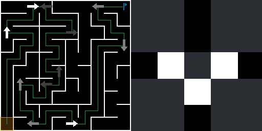
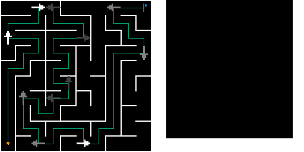

# Summary

The need to provide fair comparisons between agents, especially in the field of Reinforcement Learning, has led to a plethora of benchmarks.
However these benchmarks are, for the most part, devoted to tailor made problems with very little degrees of freedom for the experimenter.
AMaze is, instead, a benchmark *generator* capable of producing human-intelligible environment of arbitrarily high complexity.
By using, potentially custom-made, visual cues in a maze-navigation task, the library empowers researchers across a large breadth of fields.

# Statement of need

AMaze is a pure-python package with an emphasis towards easy and intuitive generation, evaluation and analysis of mazes.
Its primary goal is to provide a way to quickly generate mazes of targeted difficulty e.g. to test a Reinforcement Learning algorithm.
Without paraphrasing the documentation[^1] too much, users of AMaze have two main components to take into consideration: mazes and agents.

## Mazes

Every maze can be described by human-readable string as illustrated in \autoref{fig:maze}, where every component is optional with sensible default values (excepted the *seed* which is time-dependent).
The *seed* is used in the random number generator responsible for: a) the depth-first search that creates the part and b) the stochastic placement of the *lures* and *traps*.
As will be detailed below, agents only see a single cell at a time making intersections impossible to handle without additional information.
*Clues* provide such an information by helpfully pointing towards the correct direction.
However, users may additionally specify the presence of *traps*, at a given frequency, to replace a clue at an intersection.
Traps always point towards the wrong direction (randomly so in case of a three-way intersection) thereby forcing agents to discriminate between the two.
Furthermore, there is a lighter class of negative sign, namely *lures*, which occur outside of intersection and unhelpfully point towards an obviously bad direction (e.g. a wall).

Mazes can broadly be grouped by class depending on the features they exhibit.
The most *trivial* cases correspond to mazes with a single path (enforced by "filling-in" intersections).
When intersections are labeled with appropriate clues mazes are considered as *simple*.
Additionally exhibiting either lures or traps form the corresponding classes while the more general case with all types of signs is labeled as *complex*.
To accurately compare between different types of mazes across multiple categories, the library provides two dedicated metrics.
The surprisingness $S_M$ and deceptiveness $D_M$ for a given maze $M$ are as follows:

$$S_M = - \sum\limits_{i \in I_M} p(i) * log_2(p(i))$$
$$D_M = \sum\limits_{c \in \text{cells}(M)}
           \sum\limits_{\substack{s \in \text{traps}(M)\\s[0:3] = c}}
            - p(s|c) log_2(p(s|c))$$

which, informally, account for the likelihood of encountering different states (walls, signs) and different *variations* of a given cell (same walls, different signs).
Through this, experimenters can make an informed decision about the level of complexity of the mazes they use.
As illustrated in \autoref{fig:complexity}, the space of all possible mazes[^2] is both diverse and arbitrarily complex.

[^1]: [https://amaze.readthedocs.io/en/latest/](https://amaze.readthedocs.io/en/latest/)
[^2]: Sampled from 500'000 unique mazes across all five classes

## Agents

Agents in AMaze are loosely embodied robots that wander around mazes perceiving only local information (the cell they are in) and a single bit of memory (the direction they come from, if any).
To accommodate various use cases, these agents come in three different forms: fully discrete, fully continuous and hybrid.
In the former case, an agent has access to something akin to a pre-processed input, as in \autoref{fig:inputs}, where the first four fields describes the wall configuration and the remainder provide information about signs, if any.
The direction of the previous cell is depicted in red *for the benefit of the human observer* as agents only perceive grayscale values.
In the fully discrete case, these observations are used to deduce the correct action out of the four cardinal directions.

In the hybrid case, actions are identical while observations now become coarse-grained images where walls are indicated by with pixels on the perimeter.
The temporal information of the previous direction is still provided, as a single white pixel centered on the appropriate side.
More importantly, the center of the image is used to display an arbitrary shape as a sign (clue, lure or trap).
Finally, the fully continuous case is characterized by having the robot control its acceleration instead of choosing one cardinal direction.
Thus, in addition to accurately processing visual data, the agent must also infer and take into consideration its position and intertia.

# Python Ecosystem

As stated in the introduction, numerous benchmarks have been developed in recent years especially in the Python Ecosystem.
Thanks to its interoperability,

<!-- { width=33% } -->
<!-- { width=33% } -->
<!-- { width=33% } -->

Citations to entries in paper.bib should be in
[rMarkdown](http://rmarkdown.rstudio.com/authoring_bibliographies_and_citations.html)
format.

If you want to cite a software repository URL (e.g. something on GitHub without a preferred
citation) then you can do it with the example BibTeX entry below for @fidgit.

For a quick reference, the following citation commands can be used:
- `@author:2001`  ->  "Author et al. (2001)"
- `[@author:2001]` -> "(Author et al., 2001)"
- `[@author1:2001; @author2:2001]` -> "(Author1 et al., 2001; Author2 et al., 2002)"

# Figures

Figures can be included like this:

and referenced from text using \autoref{fig:example}.

# Acknowledgements

We acknowledge contributions from Brigitta Sipocz, Syrtis Major, and Semyeong
Oh, and support from Kathryn Johnston during the genesis of this project.

# References
